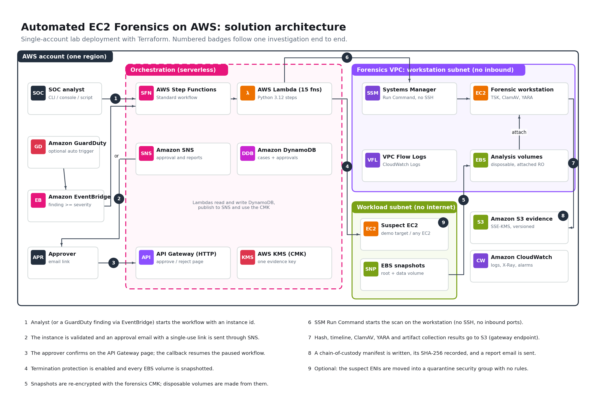
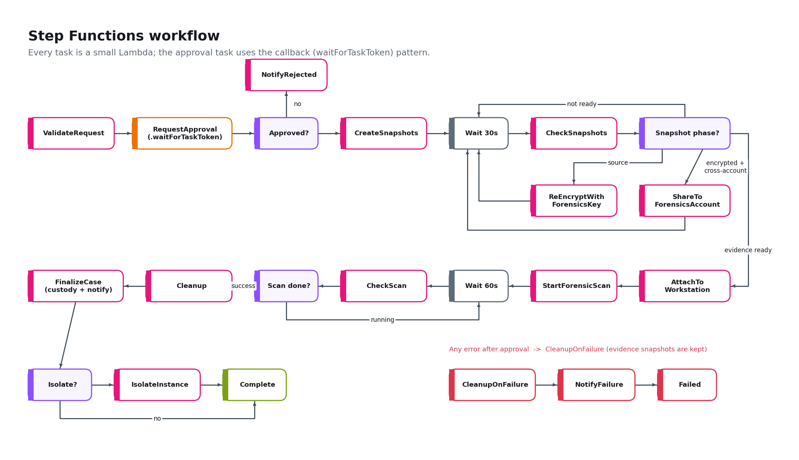
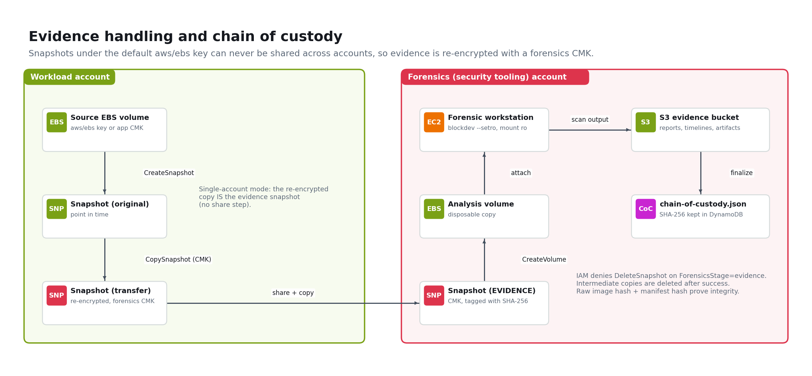
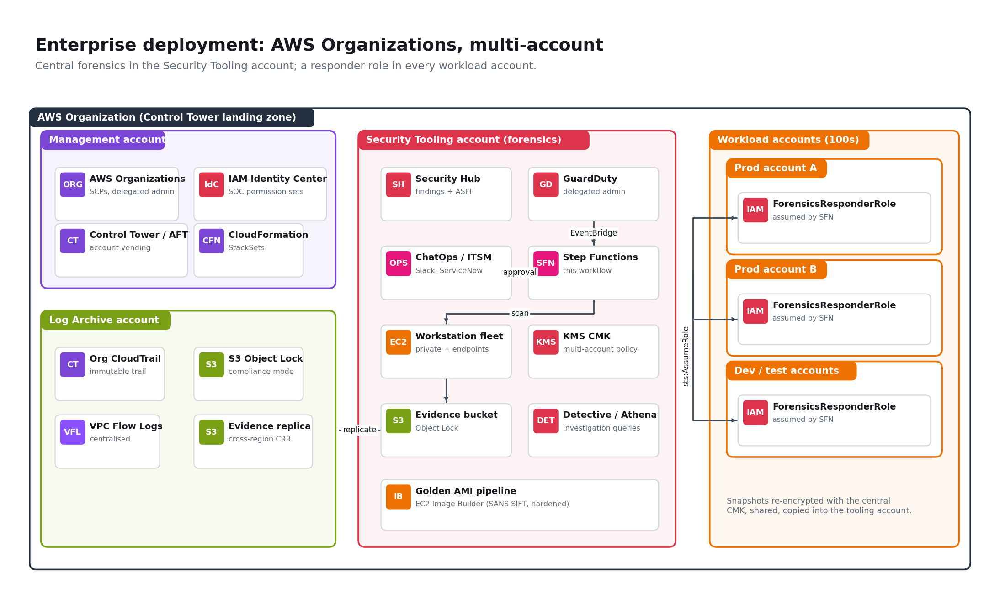

# Automated EC2 Forensics on AWS (Step Functions + Terraform)

[](https://github.com/amahjoshdevsec/aws-automated-ec2-forensics/actions/workflows/ci.yml)


A self-service, approval-gated digital forensics pipeline for Amazon EC2. An analyst (or a GuardDuty finding) names a suspect instance; a human approves; the workflow preserves every EBS volume as encrypted evidence, analyses a disposable copy on an isolated forensic workstation, writes a hashed chain-of-custody record and, optionally, quarantines the instance. No SSH, no console hopping into workload accounts, no developers pulled off their work.

This project is an open, reproducible implementation of the pattern described in the AWS case study [*Speeding Up Security Forensics by 97.5% Using AWS Step Functions with OneMain Financial*](https://aws.amazon.com/solutions/case-studies/onemain-financial-aws-sfn-case-study/). It is not affiliated with OneMain Financial or AWS; it rebuilds the publicly described architecture so anyone can deploy and study it.



## Contents

1. [What it does](#what-it-does)
2. [Architecture](#architecture)
3. [Assumptions](#assumptions)
4. [Prerequisites](#prerequisites)
5. [Deploy in your own AWS account (Option A: laptop)](#option-a-deploy-from-your-laptop)
6. [Deploy with GitHub Actions and OIDC (Option B: no local tooling)](#option-b-deploy-with-github-actions-oidc-no-access-keys)
7. [Run an investigation end to end](#run-an-investigation-end-to-end)
8. [What the evidence looks like](#what-the-evidence-looks-like)
9. [Configuration reference](#configuration-reference)
10. [Security design](#security-design)
11. [Enterprise and production implementation](#enterprise-and-production-implementation)
12. [Cost](#cost)
13. [Testing and CI](#testing-and-ci)
14. [Tear down](#tear-down)
15. [Troubleshooting](#troubleshooting)
16. [Repository layout](#repository-layout)

## What it does

| Stage | What happens | AWS services |
|---|---|---|
| Trigger | Analyst runs one command, or a high severity GuardDuty EC2 finding fires | Step Functions, EventBridge, GuardDuty |
| Validate | Instance id, account allow-list and region are checked; metadata (AZ, IPs, SGs, ENIs, role, volumes) is captured | Lambda, EC2 API |
| Approve | Workflow pauses. Approver receives an email with a single-use link and approves or rejects on a confirmation page | SNS, API Gateway, DynamoDB, Step Functions callback |
| Preserve | Termination protection on, every EBS volume snapshotted, snapshots re-encrypted with the forensics KMS key (and shared/copied cross-account in multi-account mode) | EC2/EBS, KMS |
| Analyse | Disposable volumes are created from the evidence snapshots, attached to the workstation, set read-only and scanned: SHA-256 of the raw image, Sleuth Kit timeline, ClamAV, YARA, persistence and artifact collection | SSM Run Command, EC2 |
| Record | Report, timelines and artifacts go to an encrypted, versioned S3 bucket. A chain-of-custody manifest is written and its hash stored in DynamoDB; the evidence snapshot is tagged with the image hash | S3, DynamoDB |
| Contain (optional) | The suspect's ENIs are moved into a quarantine security group with no inbound or outbound rules | EC2 |
| Clean up | Analysis volumes and intermediate snapshots are deleted; the evidence snapshot is kept and cannot be deleted by the automation | EC2, IAM conditions |

Mapping to the case study: the OneMain solution validates the account and instance, requests approval, snapshots the EBS volume, creates an encrypted copy (using "cryptographic logic" to overcome the movement limits of encrypted volumes), moves it to a sandboxed forensics account running a SANS SIFT workstation, scans automatically, stores a report in S3, notifies the analyst and offers isolation. Every one of those steps exists here.

## Architecture

### Solution overview

The overview diagram above shows the lab deployment in a single account. Components:

1. **AWS Step Functions (Standard)** orchestrates 24 states. It is the single audit trail of each case (execution history is retained for 90 days; the permanent record lives in DynamoDB and S3).
2. **15 AWS Lambda functions** (Python 3.12, arm64) each do one step and pass one JSON "case state" document along.
3. **Approval gate**: `lambda:invoke.waitForTaskToken` pauses the workflow. The task token is stored server side in DynamoDB under a random 256-bit id; only that id travels in the email. GET shows a confirmation page (so email security scanners that pre-fetch links cannot approve anything); POST records the decision, deletes the id (single use) and calls `SendTaskSuccess`.
4. **Forensic workstation**: Ubuntu 24.04 in a dedicated VPC subnet with no inbound rules, IMDSv2 enforced, encrypted with the forensics key, reachable only through Systems Manager. It carries The Sleuth Kit, ClamAV and YARA. The scan script and YARA rules are versioned in S3 and pulled at scan time.
5. **Evidence store**: S3 with SSE-KMS (bucket keys), versioning, TLS-only policy, public access block, a deny on deletes by the automation roles, a Deep Archive lifecycle rule and optional Object Lock.
6. **Observability**: CloudWatch Logs (KMS encrypted) for every Lambda, the state machine, the approval API, the scan output and VPC flow logs; X-Ray tracing; alarms on failed or timed out investigations.

### Workflow



The snapshot loop runs once per phase (`source`, `encrypted`, and in multi-account mode `evidence`), waiting 30 seconds between checks. Any error after approval goes to `CleanupOnFailure`, which removes disposable volumes but never deletes a snapshot, then emails the failure.

### Evidence handling



Why the re-encryption step matters: EBS snapshots encrypted with the AWS managed `aws/ebs` key can never be shared with another account, and most workloads use exactly that key. Copying the snapshot under a customer managed key whose policy trusts the forensics account is the "cryptographic logic" that lets evidence move out of the workload account without touching the running instance.

## Assumptions

These are stated deliberately so reviewers know exactly what the lab does and does not claim.

1. **One region per deployment.** The workflow investigates instances in the region it is deployed in. Deploy the stack once per region you operate in (production: one stack per region in the security tooling account).
2. **Single-account by default.** The lab puts the "workload" (demo target) and the forensic workstation in the same account but in separate subnets with no route between them and no internet route for the target. Multi-account is built in (`member_account_ids` plus `modules/member-account-role`) and described below.
3. **EBS-backed Linux instances.** Instance store volumes are ephemeral and are not captured. The scan understands ext2/3/4, XFS, VFAT and NTFS partitions. LVM volumes are captured and hashed but not auto-mounted. Windows instances are preserved and hashed; the Linux-focused triage finds less on NTFS.
4. **Source volume encryption.** Volumes encrypted with `aws/ebs` or with a customer managed key in the same account that allows use through EC2 work in single-account mode. For cross-account, the member role must be allowed to use the source volume's key (the module grants this through `kms:ViaService`); keys with restrictive policies need an explicit grant.
5. **Disk-only forensics.** This pipeline captures and analyses disk state. Memory acquisition (for example with AVML or LiME pushed through SSM before snapshotting) is listed under production extensions because it requires running tooling inside the suspect instance.
6. **Crash-consistent snapshots.** Snapshots are taken while the instance runs, which is the standard trade-off for live response (no downtime, no tipping off an attacker). The raw image hash is taken from the analysis copy, which is bit-for-bit the evidence snapshot.
7. **Email approval is a lab convenience.** Anyone who holds an unexpired link can decide the case. Production should authenticate the approver (Cognito / IAM Identity Center) or move approval into ChatOps or ITSM (see below).
8. **The workstation has a public IP for egress only** (package installs, ClamAV signatures, AWS APIs). It has no inbound rules and no SSH key. Production should use private subnets with VPC endpoints and a pre-baked golden AMI.
9. **One case at a time per workstation** is the tested path. Concurrent cases use different device slots and work, but heavy concurrency should use a workstation per case (see production section).
10. **The demo target is inert.** It contains an EICAR test file, a fake miner config, a cron entry pointing at a script that exits immediately, a fake SSH key and a one-line PHP webshell on a second volume. Nothing executes and it has no network egress. The addresses used are reserved documentation ranges (203.0.113.0/24, example.invalid).

## Prerequisites

| Requirement | Notes |
|---|---|
| AWS account | A personal/sandbox account where you can create IAM roles. Admin or PowerUser + IAM permissions. |
| Terraform >= 1.7 | `terraform -version` (Option A only) |
| AWS CLI v2 | Configured with credentials, preferably `aws configure sso` or `aws login` (Option A only) |
| jq, bash | For the helper scripts (macOS, Linux, WSL, or AWS CloudShell) |
| An email inbox | Receives the SNS approval and report emails |
| Git + GitHub account | To clone or fork this repository |

Tip: [AWS CloudShell](https://console.aws.amazon.com/cloudshell) already has the AWS CLI, jq and git and is authenticated as your console user. Install Terraform there with the commands in [Troubleshooting](#troubleshooting).

## Option A: deploy from your laptop

### 1. Clone and configure

```bash
git clone https://github.com/amahjoshdevsec/aws-automated-ec2-forensics.git
cd aws-automated-ec2-forensics/terraform
cp terraform.tfvars.example terraform.tfvars
```

Edit `terraform.tfvars` and set at least:

```hcl
region         = "us-east-1"
approver_email = "you@example.com"
```

### 2. Authenticate to AWS

```bash
aws configure sso            # or: aws login / export AWS_PROFILE=my-sandbox
aws sts get-caller-identity  # confirm you are in the intended account
```

### 3. Deploy

```bash
terraform init
terraform plan -out tfplan
terraform apply tfplan
```

Deployment takes about 3 to 5 minutes and creates about 100 resources. When it finishes:

1. **Confirm the two SNS subscription emails** ("AWS Notification - Subscription Confirmation") for the approvals and notifications topics. Without this you will not receive the approval link.
2. **Wait about 5 minutes** for first boot: the workstation installs its tools and downloads ClamAV signatures, and the demo target plants its indicators. (The workflow also waits for this automatically.)

Useful outputs:

```bash
terraform output
# state_machine_console_url, evidence_bucket, workstation_instance_id,
# test_target_instance_id, start_investigation_command, approval_api_url
```

## Option B: deploy with GitHub Actions (OIDC, no access keys)

The repository ships a manual **Deploy to AWS lab account** workflow that authenticates with GitHub OIDC, so no AWS keys are ever stored in GitHub.

1. **Fork or use this repository** in your GitHub account.
2. **Create the deploy role and state bucket** (one time). In the AWS console open CloudFormation, choose *Create stack*, upload [`bootstrap/github-oidc.yaml`](bootstrap/github-oidc.yaml), set `GitHubOwner` to your GitHub user name, acknowledge IAM capabilities and create. Or from a shell:

   ```bash
   aws cloudformation deploy --template-file bootstrap/github-oidc.yaml \
     --stack-name ec2-forensics-github-oidc --capabilities CAPABILITY_NAMED_IAM \
     --parameter-overrides GitHubOwner=<your-github-user> RepositoryName=aws-automated-ec2-forensics
   ```

   Set `CreateOIDCProvider=false` if your account already has the `token.actions.githubusercontent.com` identity provider.
3. **Add repository variables** in GitHub: *Settings, Secrets and variables, Actions, Variables*:

   | Variable | Value |
   |---|---|
   | `AWS_DEPLOY_ROLE_ARN` | `DeployRoleArn` stack output |
   | `TF_STATE_BUCKET` | `StateBucketName` stack output |
   | `APPROVER_EMAIL` | your email |
   | `AWS_REGION` | optional, defaults to `us-east-1` |

4. **Run it**: *Actions, Deploy to AWS lab account, Run workflow* and pick an action:

   | Action | What it does |
   |---|---|
   | `plan` | `terraform plan` against remote state |
   | `apply` | deploys the stack |
   | `smoke-test` | runs [`scripts/smoke-test.sh`](scripts/smoke-test.sh): starts a case on the demo target, approves it programmatically, waits for completion and asserts the planted indicators were found |
   | `apply-and-smoke-test` | both, in one run (about 20 to 30 minutes) |
   | `destroy` | cleans up workflow-created resources and destroys the stack |

   Remember to confirm the SNS subscription emails after the first `apply`.

## Run an investigation end to end

### 1. Start a case

```bash
bash scripts/start-investigation.sh                                   # demo target
bash scripts/start-investigation.sh i-0abc123def4567890 "GuardDuty: CryptoCurrency:EC2/BitcoinTool.B" --isolate
```

or directly with the CLI:

```bash
aws stepfunctions start-execution \
  --state-machine-arn "$(terraform -chdir=terraform output -raw state_machine_arn)" \
  --input '{"instance_id":"i-0abc123def4567890","requested_by":"analyst@corp","reason":"suspicious outbound traffic","isolate":false}'
```

Input fields:

| Field | Required | Description |
|---|---|---|
| `instance_id` | yes | EC2 instance to investigate |
| `account_id` | no | Workload account (defaults to the forensics account). Must be in `member_account_ids` |
| `region` | no | Must equal the deployment region |
| `case_id` | no | Your ticket number; generated as `CASE-YYYYMMDD-HHMMSS-xxxxxx` if omitted |
| `requested_by`, `reason` | no | Recorded in the case file and approval email |
| `isolate` | no | `true` moves the instance into the quarantine security group after analysis |

### 2. Approve

The approver receives *"[Forensics] Approval needed: CASE-..."* with the instance details and a link. The link opens a confirmation page with **Approve** and **Reject** buttons.

### 3. Watch it run

Open `state_machine_console_url`. The graph view shows each state turning green; the snapshot and scan loops are visible as repeated Wait/Check steps. A demo case with an 8 GiB root and 1 GiB data volume typically completes in 15 to 25 minutes, most of it EBS snapshot time.

### 4. Review the results

You receive *"[Forensics] Report ready"* with totals and S3 locations.

```bash
BUCKET=$(terraform -chdir=terraform output -raw evidence_bucket)
aws s3 ls s3://$BUCKET/cases/ --recursive | head
aws s3 cp s3://$BUCKET/cases/<CASE_ID>/analysis/report.md - | less
aws s3 cp s3://$BUCKET/cases/<CASE_ID>/chain-of-custody.json - | jq .
aws dynamodb get-item --table-name ec2-forensics-cases --key '{"case_id":{"S":"<CASE_ID>"}}'
```

To inspect evidence interactively (read-only), open a shell on the workstation with no SSH:

```bash
aws ssm start-session --target "$(terraform -chdir=terraform output -raw workstation_instance_id)"
```

## What the evidence looks like

```
s3://<evidence-bucket>/cases/CASE-20260928-141502-9f31ab/
  chain-of-custody.json          <- case metadata, approval (ip, time), snapshot ids, image hashes, full history
  analysis/
    report.md                    <- human readable triage report
    summary.json                 <- machine readable totals (feeds the email and DynamoDB)
    manifest.sha256              <- SHA-256 of every output file
    tool-versions.txt            <- tool versions + hash of the scan script and rule set used
    scan.log
    artifacts.tar.gz             <- passwd, sudoers, cron, systemd units, ssh keys, shell history, auth logs
    vol-0abc.../nvme1n1p1/
      timeline-find.csv          <- mtime/atime/ctime for every file
      bodyfile.txt, timeline-mactime.csv   <- Sleuth Kit timeline (where the filesystem is supported)
      clamav.txt, yara.txt
      persistence.txt, suspicious-files.txt, suid-files.txt, recently-modified.txt
  ssm-output/                    <- raw SSM command stdout/stderr
```

Against the demo target the report should show, among others: ClamAV `Eicar-Signature FOUND` for `/tmp/.cache/update.com`; YARA `Linux_CryptoMiner_Indicators` for `/var/tmp/.x11/config.json`, `Linux_Reverse_Shell_Oneliner` for `/usr/local/bin/.sysupdate`, `PHP_Webshell_Generic` for `uploads/thumb.php` on the data volume; persistence item `/etc/cron.d/sysupdate` and the planted `authorized_keys`.

## Configuration reference

All variables are in [`terraform/variables.tf`](terraform/variables.tf). The most relevant:

| Variable | Default | Purpose |
|---|---|---|
| `approver_email` | (required) | Receives approval requests |
| `notification_email` | approver | Receives reports, failures and alarms |
| `region` | `us-east-1` | Deployment and investigation region |
| `deploy_test_target` | `true` | Demo compromised instance |
| `workstation_instance_type` | `t3.medium` | Increase for large volumes |
| `workstation_ami_id` | latest Ubuntu 24.04 | Point at a golden or SIFT AMI |
| `approval_timeout_seconds` | `86400` | Case fails if nobody decides |
| `scan_timeout_seconds` | `7200` | SSM execution timeout |
| `max_volumes_per_instance` | `4` | Safety limit |
| `enable_guardduty_trigger` | `false` | Auto-open cases for GuardDuty EC2 findings |
| `guardduty_min_severity` | `7` | Threshold for the trigger |
| `member_account_ids` | `[]` | Enables multi-account mode |
| `enable_object_lock` | `false` | WORM evidence (governance mode) |
| `force_destroy_evidence_bucket` | `true` | Set `false` in production |
| `log_retention_days` | `365` | CloudWatch Logs retention |

## Security design

| Control | Implementation |
|---|---|
| Human in the loop | Callback pattern; nothing touches the suspect until an approver decides. Decision, time, IP and user agent go into the custody record |
| Link safety | Token never leaves AWS; 256-bit single-use id; GET is side-effect free; strict CSP, no-store, no-referrer; API throttled |
| Least privilege | Separate roles for orchestrator, approval callback, workstation, state machine, flow logs. Volume creation, deletion and detach are conditioned on `ForensicsStage=analysis` tags |
| Evidence immutability | IAM only allows deleting snapshots tagged `original` or `transfer`; S3 denies deletes by automation roles; versioning; optional Object Lock |
| Encryption | One customer managed key with rotation for snapshots, volumes, S3, DynamoDB, SNS, Lambda environment and all log groups |
| Write blocking | Analysis runs on a copy; the block device is set read-only (`blockdev --setro`) and mounted `ro,noload/norecovery,noexec,nodev,nosuid`; LVM auto-activation and udisks disabled |
| Integrity | SHA-256 of each raw image (tagged on the evidence snapshot), `manifest.sha256` of every output, SHA-256 of the custody manifest stored in DynamoDB |
| Workstation hardening | No SSH key, no inbound rules, SSM only, IMDSv2 with hop limit 1, encrypted root, egress limited to 80/443, flow logs on |
| Injection resistance | Every value placed in the SSM shell command is validated with strict regexes in Lambda and again in the script |
| Self-protection | The workflow refuses to investigate the forensic workstation; account allow-list; region check; volume count limit |
| Supply chain | CI runs Checkov, ShellCheck, `terraform validate` and mocked `terraform test`; the scan script and rule hashes are recorded in every report |

## Enterprise and production implementation

The lab is intentionally the smallest thing that demonstrates the full pattern. This is how it maps onto a real organisation.



### Account structure

1. **Deploy the forensics stack in the Security Tooling (Audit) account** of your AWS Organization or Control Tower landing zone, one stack per operating region. Set `deploy_test_target = false`.
2. **Deploy `terraform/modules/member-account-role` into every workload account** so the orchestrator can assume `ForensicsResponderRole`. Options: Account Factory for Terraform (AFT) account customizations, a Terraform pipeline with one provider alias per account, or an equivalent CloudFormation StackSet with service-managed permissions targeting the workload OUs so new accounts get the role automatically.

   ```hcl
   module "forensics_responder" {
     source                 = "git::https://github.com/amahjoshdevsec/aws-automated-ec2-forensics.git//terraform/modules/member-account-role"
     providers              = { aws = aws.workload_prod_a }
     forensics_account_id   = "111111111111"
     orchestrator_role_name = "ec2-forensics-orchestrator"
     forensics_kms_key_arn  = "arn:aws:kms:us-east-1:111111111111:key/..."
   }
   ```
3. **List the accounts** in `member_account_ids` in the forensics stack. The KMS key policy and the orchestrator's `sts:AssumeRole` permission are generated from that list. For hundreds of accounts, replace the explicit list with `aws:PrincipalOrgID` / `aws:PrincipalOrgPaths` conditions.
4. **Protect the responder role with an SCP** so workload account admins cannot modify or delete it, and so only the forensics account can assume it.

### Triggers and approvals

1. **GuardDuty delegated administrator** in the Security Tooling account aggregates findings from all accounts; enable `enable_guardduty_trigger` so high severity EC2 findings open cases automatically (still approval gated). Add Security Hub custom actions so an analyst can send any finding to the workflow with one click.
2. **Replace email approval** with an authenticated channel: Slack or Teams interactive messages (AWS Chatbot or a small bot calling `SendTaskSuccess`), a ServiceNow / Jira approval task that calls back through an authenticated API, or Cognito / IAM Identity Center in front of the API Gateway route. Record the approver identity, not just the IP.
3. **Two-person rule** for isolation of production systems: require a second approval state before `IsolateInstance`.

### Workstation and tooling

1. **Private subnets only**: remove the public IP, add interface endpoints for `ssm`, `ssmmessages`, `ec2messages`, `kms`, `logs`, `sts` and `ec2` (S3 gateway endpoint already exists) and deny internet egress.
2. **Golden AMI** built by EC2 Image Builder with the full SANS SIFT toolkit, hardened to CIS level 1, signatures pre-loaded and refreshed nightly through a controlled mirror. Point `workstation_ami_id` at it.
3. **Per-case workstations** for scale and isolation: launch a fresh instance from the golden AMI per case (or a Step Functions `Map` over volumes with an Auto Scaling group) and terminate it when the case closes. This also removes any chance of cross-case contamination.
4. **Faster restores**: enable EBS Fast Snapshot Restore on evidence snapshots for large volumes, or use the EBS direct APIs to hash snapshots without creating volumes.
5. **Curated detection content**: pull YARA rules and IOC feeds from your threat intelligence pipeline into `tools/rules/` through a reviewed pull request; sign the scan script (for example with AWS Signer or cosign) and verify it before execution.
6. **Memory acquisition**: add an optional pre-snapshot state that runs AVML/LiME through SSM on the suspect and streams the image to the evidence bucket, for cases where volatile data matters.

### Evidence governance

1. `enable_object_lock = true` (and consider **compliance mode** in the Log Archive account), `force_destroy_evidence_bucket = false`, retention aligned with legal hold policy.
2. **Cross-region replication** of the evidence bucket to the Log Archive account, S3 server access logging and CloudTrail data events on the bucket.
3. **Separate keys** per environment or per case type, with key administrators distinct from key users; KMS key policy denying `ScheduleKeyDeletion` except to break-glass roles.
4. **Case management**: push the custody manifest and findings into your SIEM or case tool (Security Lake / OpenSearch / Splunk) and Security Hub as an ASFF finding update.

### Delivery and operations

1. **Remote state** in S3 with native locking (`backend.tf.example`), plans reviewed in pull requests, applies from a pipeline role with a permissions boundary (the bootstrap template's `DeployPolicyArn` parameter).
2. **Policy as code**: Checkov already blocks the build; add OPA/Conftest or Sentinel for organisation rules; enable Lambda code signing.
3. **Game days**: run `scripts/smoke-test.sh` on a schedule in a sandbox account so the pipeline is proven to work before an incident needs it.
4. **Runbooks and SLOs**: track time from alert to report (the OneMain metric), approval wait time and failure rate using the CloudWatch metrics and the cases table.

## Cost

Approximate us-east-1 on-demand prices, lab defaults:

| Item | If left running for a month | For a 2 hour test |
|---|---|---|
| Workstation t3.medium + 40 GB gp3 + public IPv4 | about $37 | about $0.10 |
| Demo target t3.micro + 9 GB gp3 | about $8 | about $0.02 |
| KMS key | $1 | prorated |
| Evidence snapshots (per case, ~9 GB of data) | about $0.45 per case per month | cents |
| Lambda, Step Functions, DynamoDB, API Gateway, SNS, S3 | well under $1 at lab volume | cents |
| CloudWatch Logs, VPC flow logs | about $1 | cents |

Save money between tests: stop the workstation (`aws ec2 stop-instances --instance-ids <id>`). The workflow **starts it automatically** when the next case reaches the analysis step. Destroy the stack when you are done.

## Testing and CI

| Layer | How | Needs AWS? |
|---|---|---|
| Lambda unit tests (26) | `python -m pytest tests/` with mocked AWS clients: validation, injection rejection, approval single use and expiry, snapshot phases, device allocation, cleanup never deleting evidence, isolation | No |
| State machine | Test asserts the ASL renders to valid JSON and every transition target exists and every state is reachable | No |
| Terraform | `terraform fmt`, `validate`, and `terraform test` against a mocked AWS provider (defaults, production settings, input validation) | No |
| Static analysis | Checkov (blocking; the few intentional exceptions are justified inline with `checkov:skip`), ShellCheck | No |
| End to end | `scripts/smoke-test.sh` or the Deploy workflow's `smoke-test` action | Yes |

```bash
make test     # unit + terraform tests
make smoke    # end to end against your deployed stack
```

## Tear down

The workflow deliberately creates evidence that Terraform does not own (so a redeploy never destroys evidence), enables termination protection on investigated instances and may create a quarantine security group. Clean those up first:

```bash
bash scripts/pre-destroy.sh --delete-evidence   # omit the flag to keep evidence snapshots
cd terraform && terraform destroy
```

## Troubleshooting

| Symptom | Fix |
|---|---|
| No approval email | Confirm the SNS subscription emails; check spam; `aws sns list-subscriptions` should not show `PendingConfirmation` |
| `ValidationError: account ... not in the allowed account list` | Add the account to `member_account_ids` and deploy the member role there |
| `StartForensicScan` retries with `WorkstationNotReady` | Workstation is booting or was stopped; it is started automatically and retried for up to 15 minutes |
| Scan fails with `test -f /opt/forensics/.bootstrap-complete` | First boot could not install packages: check `/var/log/cloud-init-output.log` through Session Manager |
| Snapshot phase takes long | EBS snapshot speed depends on changed blocks; first snapshots of large volumes can take many minutes |
| `terraform destroy` fails on the demo instance | Termination protection is on: run `scripts/pre-destroy.sh` first |
| `terraform destroy` fails on the VPC | A quarantine security group exists: run `scripts/pre-destroy.sh` |
| Installing Terraform in CloudShell | `sudo yum install -y yum-utils && sudo yum-config-manager --add-repo https://rpm.releases.hashicorp.com/AmazonLinux/hashicorp.repo && sudo yum -y install terraform` |

## Repository layout

```
.
├── bootstrap/github-oidc.yaml        # one-time GitHub OIDC deploy role + state bucket (CloudFormation)
├── docs/
│   ├── images/                       # architecture diagrams used in this README
│   ├── diagrams/generate_diagrams.py # regenerates the diagrams
│   ├── INTERVIEW-GUIDE.md            # talking points, design decisions, trade-offs
│   └── SCREENSHOTS.md                # checklist for capturing console screenshots from your deployment
├── scripts/
│   ├── start-investigation.sh        # start a case
│   ├── smoke-test.sh                 # end-to-end test with programmatic approval
│   └── pre-destroy.sh                # clean up workflow-created resources
├── src/
│   ├── lambda/                       # 15 workflow step functions (Python 3.12)
│   ├── workstation/                  # bootstrap, forensic-scan.sh, YARA rules
│   └── test-target/user-data.sh      # inert indicators planted on the demo target
├── terraform/
│   ├── *.tf                          # root module (KMS, S3, DynamoDB, SNS, VPC, workstation, Lambda, SFN, API, EventBridge)
│   ├── templates/state_machine.asl.json
│   ├── modules/member-account-role/  # deploy into each workload account
│   └── tests/forensics.tftest.hcl    # mocked-provider tests
├── tests/test_lambdas.py
└── .github/workflows/                # CI and manual deploy (OIDC)
```

## Author

Built by **Joshua Amah**, cloud security and DevSecOps engineer (8x AWS certified, including Security Specialty and Solutions Architect Professional). [LinkedIn](https://www.linkedin.com/in/joshuaamah)

Licensed under the [MIT License](LICENSE).
